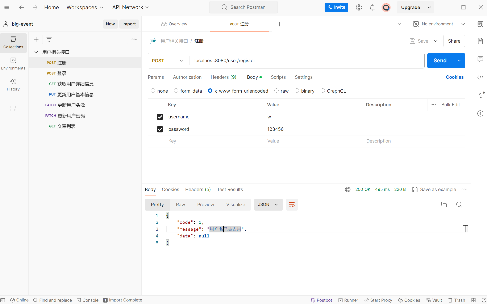
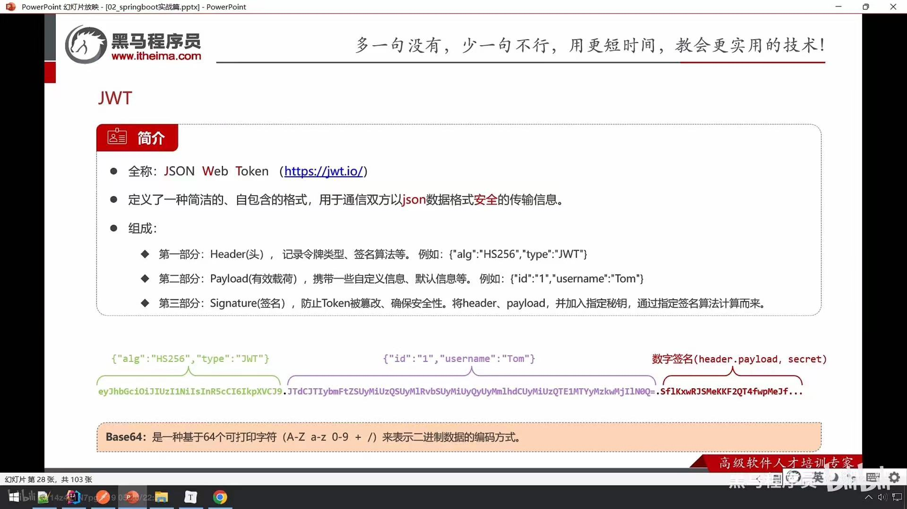

# big-event开发-用户（一）

## 开发流程

1. 明确需求
2. 阅读接口文档
3. 思路分析
4. 开发
5. 测试

## 注册接口

### 自动生成-lombok

在编译阶段，为实体类自动生成setter getter toString
pom文件中引入依赖 在实体类中添加注解（@Data @NoArgsConstructor @AllArgsConstructor)

### 响应结果-Result类

```java
package com.itheima.bigevent.pojo;


import lombok.AllArgsConstructor;
import lombok.Data;
import lombok.NoArgsConstructor;

//统一响应结果
@NoArgsConstructor
@AllArgsConstructor
@Data
public class Result<T> {
    private Integer code;//业务状态码  0-成功  1-失败
    private String message;//提示信息
    private T data;//响应数据

    //快速返回操作成功响应结果(带响应数据)
    public static <E> Result<E> success(E data) {
        return new Result<>(0, "操作成功", data);
    }

    //快速返回操作成功响应结果
    public static Result success() {
        return new Result(0, "操作成功", null);
    }

    public static Result error(String message) {
        return new Result(1, message, null);
    }
}
```

### 密码加密-Md5加密

```java
// 加密
String md5String = Md5Util.getMD5String(password);
// 添加
userMapper.add(username, md5String);
```

### 测试工具-Postman



### 参数校验-Validation

1. 引入Spring Validation起步依赖

2. 在参数前添加@Pattern注解

3. 在Controller类添加@Validated注解


```java
@PostMapping("/register")
public Result register(@Pattern(regexp = "^\\S{5,16}$") String username, @Pattern(regexp = "^\\S{5,16}$") String password) {
    // 查询用户
    User u = userService.findByUserName(username);
    if (u == null) {
        // 没有占用
        // 注册
        userService.register(username, password);
        return Result.success();
    } else {
        // 占用
        return Result.error("用户名已被占用");
    }
}
```

#### 失败异常处理

在全局异常处理器中处理参数校验失败的异常

```java
@RestControllerAdvice
public class GlobalExceptionHandler {
    @ExceptionHandler(value = Exception.class)
    public Result handleException(Exception e){
        e.printStackTrace();
        return Result.error(StringUtils.hasLength(e.getMessage())? e.getMessage() : "操作失败");
    }
}
```

## 用户登录

### 登录认证-JWT

令牌

- 承载业务数据，减少后续请求查询数据库的次数
- 防篡改，保证信息的合法性和有效性



#### 使用方法

- 引入java-jwt坐标
- 调用API生成和校验令牌
- 解析令牌抛出异常，就证明令牌被篡改或过期

#### 生成

```java
public class JwtTest {
    @Test
    public void testGen() {
        Map<String, Object> claims = new HashMap<>();
        claims.put("id",1);
        claims.put("username", "张三");
        // 生成jwt的代码
        String token = JWT.create()
                .withClaim("user", claims) // 添加载荷
                .withExpiresAt(new Date(System.currentTimeMillis()+1000*60*60*12)) // 添加过期时间
                .sign(Algorithm.HMAC256("itheima")); // 指定算法，配置密钥
        System.out.println(token);
    }
}
```

#### 验证

```java
@Test
public void testParse() {
    // 定义字符串，模拟用户传过来的token
    String token = "eyJhbGciOiJIUzI1NiIsInR5cCI6IkpXVCJ9" +
            ".eyJ1c2VyIjp7ImlkIjoxLCJ1c2VybmFtZSI6IuW8oOS4iSJ9LCJleHAiOjE3MjI5MTk2OTl9" +
            ".MHuP69mbLa7a2VZpLXE-kybOWG9Tv7OB8p0JMsseDNg";
    JWTVerifier jwtVerifier = JWT.require(Algorithm.HMAC256("itheima")).build();

    DecodedJWT decodedJWT = jwtVerifier.verify(token); // 验证token, 生成一个解析后的JWT对象
    Map<String, Claim> claims = decodedJWT.getClaims();
    System.out.println(claims.get("user"));
    // 若篡改了头部和载荷部分的数据 & 密钥更改 & token过期，则验证失败
}
```

### 拦截器统一验证令牌

```java
@Component
public class LoginInterceptor implements HandlerInterceptor {
    @Override
    public boolean preHandle(HttpServletRequest request, HttpServletResponse response, Object handler) throws Exception {
        // 令牌验证
        String token = request.getHeader("Authorization");
        try {
            Map<String, Object> claims = JwtUtil.parseToken(token);
            // 放行
            return true;
        } catch (Exception e) {
            // http响应状态码为401
            response.setStatus(401);
            // 不放行
            return false;
        }
    }
}
```

注册拦截器 & 登录和注册接口放行
```java
@Configuration
public class WebConfig implements WebMvcConfigurer {

    @Autowired
    private LoginInterceptor loginInterceptor;

    @Override
    public void addInterceptors(InterceptorRegistry registry) {
        // 登录 & 注册接口不拦截
        registry.addInterceptor(loginInterceptor).excludePathPatterns("/user/login", "/user/register");
    }
}
```
