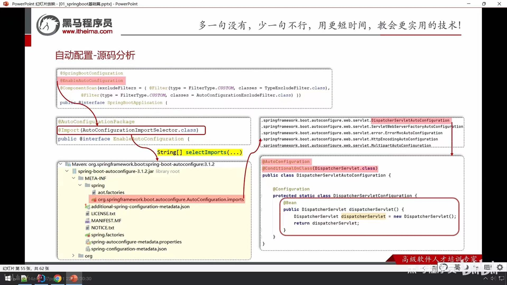
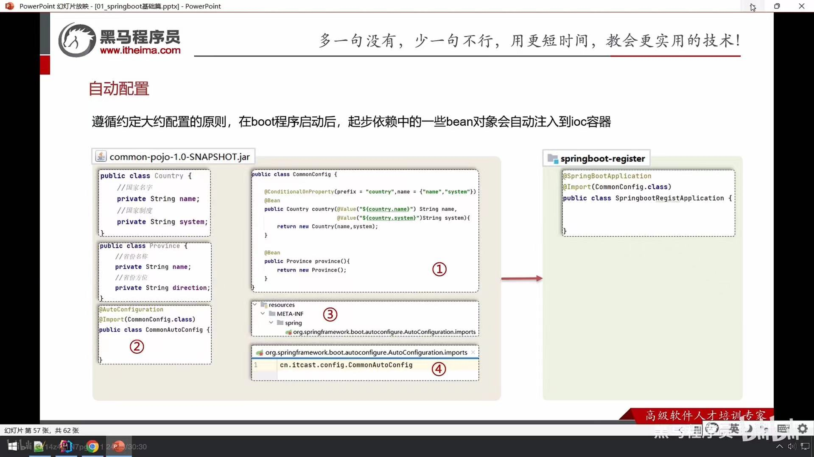
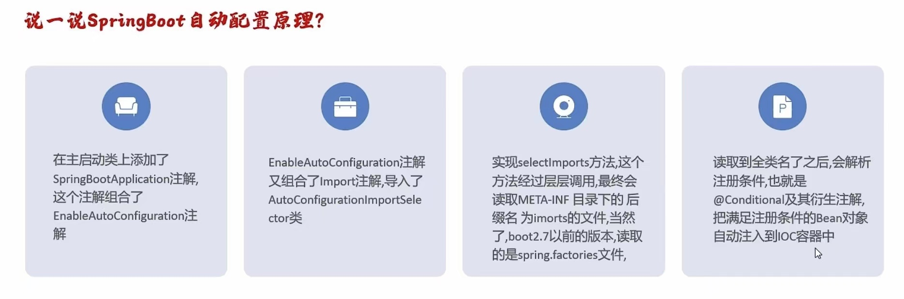
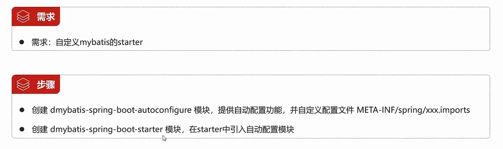

## 配置文件
### application.properties
e.g: 
~~~properties
server.port=9090
server.servlet.context-path=/start
~~~
### application.yml / yaml(常用)
e.g:
~~~yml
server:
  port: 9090
  servlet:
    context-path: /start
~~~
- 三方技术配置信息（redis...）
- 自定义配置信息  **书写&获取**
~~~yml
email:
  user: xxxxx
  code: xxxxx
  host: xxxxx
  auth: xxxxx
  hobbies: # 数组
    - aaa
    - bbb
~~~
**获取**

~~~ java
@Value("${email.user}")
public String user;
@Value("${email.code}")
public String code;

@ConfigurationProperties(predix="email")
public String user;
public String code;
~~~

## 整合mybatis
application.yml
~~~yml
spring:
  datasource:
    driver-class-name: com.mysql.cj.jdbc.Driver
    url: jdbc:mysql://172.24.219.107:3306/mybatis
    username: root
    password: xxxxxx
~~~

pom.xml
~~~xml
/ <!--mysql驱动依赖-->
<dependency>
    <groupId>com.mysql</groupId>
    <artifactId>mysql-connector-j</artifactId>
</dependency>
/ <!--mybatis起步依赖-->
<dependency>
    <groupId>org.mybatis.spring.boot</groupId>
    <artifactId>mybatis-spring-boot-starter</artifactId>
    <version>3.0.3</version>
</dependency>
~~~

## Bean扫描&注册

~~~java
// 启动类
@ComponentScan(basePackage = "com.itheima") // 手动扫描其他包
@SpringBootApplication // 仅能自动扫描该类所在的包
public class SpringbootQuickstartApplication {

    public static void main(String[] args) {
        SpringApplication.run(SpringbootQuickstartApplication.class, args);
    }

}
~~~

### 可扫描的注解

- @Component
- @Controller  # 控制器
- @Service  # 业务
- @Respository  # 数据 

### 注册的Bean对象来自第三方

不可使用@Component 及衍生注解声明bean

#### @Bean

~~~java
// 1.在启动类（不推荐）
@SpringBootApplication // 仅能自动扫描该类所在的包
public class SpringbootQuickstartApplication {
    public static void main(String[] args) {
        SpringApplication.run(SpringbootQuickstartApplication.class, args);
    }
    
    @Bean // 将方法返回值交给IOC容器管理，成为IOC容器的bean对象
    public Resolver resolver(){
        return new Resolver();
	}
}
~~~

~~~java
// 2.在配置类集中注册 （注意放到启动类所在的包/子包）
@Configuration
public class CommmonConfig {
    @Bean
    public Country country(){
        return new Country();
	}
    
    // 方法内部若要用到IOC容器中已将存在的bean对象，则只需在方法中声明即可，spring会自动注入
    @Bean
    public Province province(Country country){
        return new Country();
    }
}
~~~

#### @Import

~~~java
// 1. 导入配置类
@Import(CommonConfig.class)
@SpringBootApplication
public class SpringbootQuickstartApplication {
    public static void main(String[] args) {
        ApplicationContext context = SpringApplication.run(SpringbootQuickstartApplication.class, args);
        
        Country country = context.getBean(Country.class);
    }
}
~~~

~~~java
// 2.导入ImportSelector接口实现类 - 一次性注入多个Bean对象
public class CommonImportSelector implements ImportSelector{
    @Override
    public String[] selectImports(AnnotationMetadata importingClassMetadata){
        // 反射利用类加载器获取资源以流的方式输出(提高可维护性)
        List<String> imports = new ArrayList<>();
        InputStream is = CommonImportSelector.class.getClassLoader().getResourceAsStream("common.imports"); //路径
        BufferedReader br = new BufferedReader(new InputStreamReader(is));
        String line = null;
        try{
            while((line = br.readLine()) != null){
            	imports.add(line);
        	}
        } catch (IOException e) {
            throw new RuntimeException(e);
        } finally {
            if （br != null){
                try{
                    br.close();
                } catch (IOException e){
                    throw new RuntimeException(e);
                }
            }
        }
        return imports.toArray(new String[0]);
        // return newString[]("com.itheima.config.CommonConfig");
    }
}

// 在配置类
@Import(CommonImportSelector.class)
~~~

#### 小技巧 - 组合注解

~~~java
@Target(ElementType.TYPE)
@Retention(RetentionPolicy.RUNTIME)
@Import(CommonImportSelector.class)
public @interface EnableCommonConfig{
}

// 在配置类中仅引入
@EnableCommonConfig
~~~

### 注册条件

~~~java
// 使用@Value获取配置文件中的值
@Configuration
public class CommmonConfig {
    @Bean
    public Country country(@Value("${country.name}" String name, @Value("${country.system}") String system)){
        Country country = new Country();
        country.setName(name);
        country.setSystem(system);
        return country;
	}
    // 若配置文件中不存在对应值，则会报错
}
~~~

#### @Conditional

- ConditionalOnProperty - 配置文件中存在对应的属性，才声明该bean
- ConditionalOnMissingBean - 当不存在当前类型的bean时，才声明该bean
- ConditionalOnClass(name = " ") - 当前环境存在指定的这个类时，才声明该bean

## 自动配置原理







## 自定义starter



## Spring基础知识

### Bean
#### 生命周期

UserService.class -> 推断构造方法[可能出现循环依赖] -> 普通对象  -> 依赖注入 -> 初始化前(@PostConstruct) -> 初始化(InitializingBean) -> 初始化后(AOP) -> 代理对象 -> 放入单例池Map -> Bean对象

##### AOP

UserServiceProxy对象（动态生成UserServiceProxy代理类） -> UserService代理对象 -> UserService代理对象.target=普通对象


#### 1. Bean 的定义

在 Spring 中，Bean 是任何由 Spring IoC (控制反转) 容器创建和管理的对象。Spring 通过配置来定义这些对象，配置可以通过 XML 文件、Java 注解或 Java 配置类的形式提供。

#### 2. Bean 的作用域

Spring 支持不同的 Bean 作用域，主要包括以下几种：

- **Singleton**（单例）：这是默认作用域。Spring IoC 容器只会创建一个 Bean 实例，并在整个应用程序中共享这个实例。所有请求该 Bean 的地方都会得到同一实例。

- **Prototype**（原型）：每次请求都会创建一个新的 Bean 实例。这个作用域适用于需要不同状态或数据的对象。

- **Request**（请求）：在 Web 应用中，每次 HTTP 请求都会创建一个新的 Bean，该实例仅在当前 HTTP 请求有效。只在 Web 应用中使用。

- **Session**（会话）：在 Web 应用中，每个 HTTP 会话会有一个 Bean 实例，该实例在当前会话内有效。

- **Global Session**（全局会话）：主要用于 Portlet 应用中，类似于 Session 作用域。

#### 3. Bean 的生命周期

Bean 的生命周期由 Spring 容器负责管理，主要包括以下几个阶段：

1. **实例化**：Spring IoC 容器根据配置创建 Bean 实例。

2. **设置属性**：通过依赖注入，设置 Bean 的属性值。

3. **初始化**：如果 Bean 定义中指定了初始化方法，Spring 将调用这段方法来进行初始化，例如执行一些资源的准备或配置。

4. **使用**：Bean 被用作其他组件的依赖或直接被调用。

5. **销毁**：在容器关闭时，Spring 会调用销毁方法，以释放 Bean 占用的资源。

#### 4. Bean 的装配方式

Spring 支持多种方式来装配 Beans，这些方式包括：

- **基于 XML 的装配**：通过 XML 配置文件定义 Bean 的属性和依赖。

   ```xml
   <bean id="userService" class="com.example.UserServiceImpl">
       <property name="userMapper" ref="userMapper"/>
   </bean>
   ```

- **基于注解的装配**：使用注解（如 `@Component`, `@Service`, `@Repository`, `@Controller` 等）定义 Bean，通过 `@Autowired` 进行依赖注入。

   ```java
   @Service
   public class UserServiceImpl implements UserService {
       @Autowired
       private UserMapper userMapper;
   }
   ```

- **基于 Java 配置的装配**：通过 Java 类配置定义 Bean，通过 `@Bean` 注解。

   ```java
   @Configuration
   public class AppConfig {
       @Bean
       public UserService userService() {
           return new UserServiceImpl();
       }
   }
   ```

#### 5. Bean 的作用

- **松耦合**：使用 Bean 使得应用不同部分之间的依赖关系松散，提升了代码的可维护性和可测试性。

- **集中管理**：Spring 提供了集中管理应用程序中的组件，减少了对象自己管理的复杂性。

- **功能扩展**：通过 Spring 的 AOP（面向切面编程）等功能，可以对 Bean 进行增强，例如事务管理、安全性等，无需修改 Bean 的源码。


### 常见注解
#### 1. @Component

- 定义：`@Component` 是一个通用的注解，用于标识一个类为 Spring 的 Bean。
- 作用：Spring 会自动扫描并注册被 `@Component` 注解标记的类为 Bean。
- 使用场景：适用于任何组件，但通常用于服务层、工具类等。

```java
@Component
public class MyComponent {
    public void doSomething() {
        System.out.println("Doing something!");
    }
}
```

#### 2.@Service

- 定义：`@Service` 注解是 `@Component` 的特定变种，主要用于标识服务层的 Bean。
- 作用：除了将类标记为 Bean 之外，`@Service` 还表明这个类的主要业务逻辑是与服务层相关的。
- 使用场景：通常用于业务层类，在一些情况下，它还有助于增强可读性和可维护性。

```java
@Service
public class UserService {
    public void createUser(String username) {
        // 业务逻辑
    }
}
```

#### 3. @Repository

- 定义：`@Repository` 注解用于定义持久层的 Bean，通常与数据存储操作相关。
- 作用：除了将类标记为 Bean，`@Repository` 还可以封装数据库相关的错误，并提供了对数据访问异常的转换。
- 使用场景：通常用于 DAO 类（数据访问对象）。

```java
@Repository
public class UserRepository {
    public User findById(Long id) {
        // 数据访问逻辑
        return new User();
    }
}
```

#### 4. @Controller

- 定义：`@Controller` 注解用于标识一个控制器类，通常与 Spring MVC 中的请求处理相关。
- 作用：Spring 会将被该注解标记的类识别为 MVC 控制器，负责处理用户请求并返回相应的视图。
- 使用场景：通常用于处理 Web 请求的类。

```java
@Controller
public class UserController {
    @GetMapping("/users")
    public String getUserList(Model model) {
        // 处理请求并返回视图
        return "userList";
    }
}
```

#### 5. @Autowired

- 定义：`@Autowired` 用于自动注入 Bean 的依赖关系。
- 作用：Spring 会根据类型（默认）或名称注入相应的 Bean 实例。
- 使用场景：常用于服务、控制器等类中的依赖项。

```java
@Service
public class UserService {
    @Autowired
    private UserRepository userRepository;

    public void createUser(String username) {
        // 业务逻辑
        userRepository.save(new User(username));
    }
}
```

#### 6. @Configuration

- 定义：`@Configuration` 注解用于定义配置类，这些类用于定义 Bean。
- 作用：Spring IoC 容器会将被 `@Configuration` 注解标记的类作为配置类，并执行其方法来构造 Bean。
- 使用场景：适用于 Java 配置方式的 Spring Bean 定义。

```java
@Configuration
public class AppConfig {
    @Bean
    public UserService userService() {
        return new UserService();
    }
}
```

#### 7. @Bean

- 定义：`@Bean` 注解用于标识一个方法，该方法将返回一个被 Spring 容器管理的 Bean 实例。
- 作用：与 `@Configuration` 注解结合使用，指示 Spring 该方法用于实例化 Bean。
- 使用场景：通常用于 Java 配置类中。

```java
@Configuration
public class AppConfig {
    @Bean
    public UserService userService() {
        return new UserService();
    }
}
```

#### 8. @Value

- 定义：`@Value` 注解用于将外部配置（如 application.properties 文件中的值）注入到 Bean 的字段。
- 作用：允许读取配置文件中的参数，并自动装配到 Spring 管理的 Bean 中。
- 使用场景：适用于注入基本数据类型或字符串配置。

```java
@Component
public class AppConfig {
    @Value("${app.customProperty}")
    private String customProperty;

    public void printProperty() {
        System.out.println("Custom Property: " + customProperty);
    }
}
```
