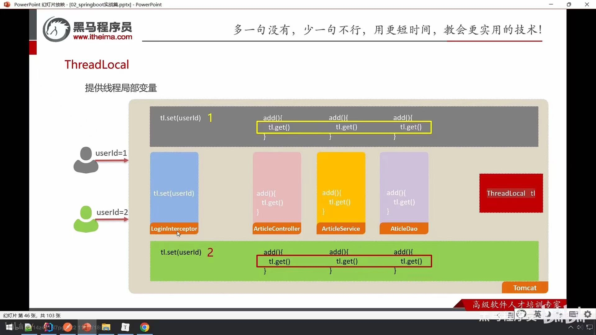
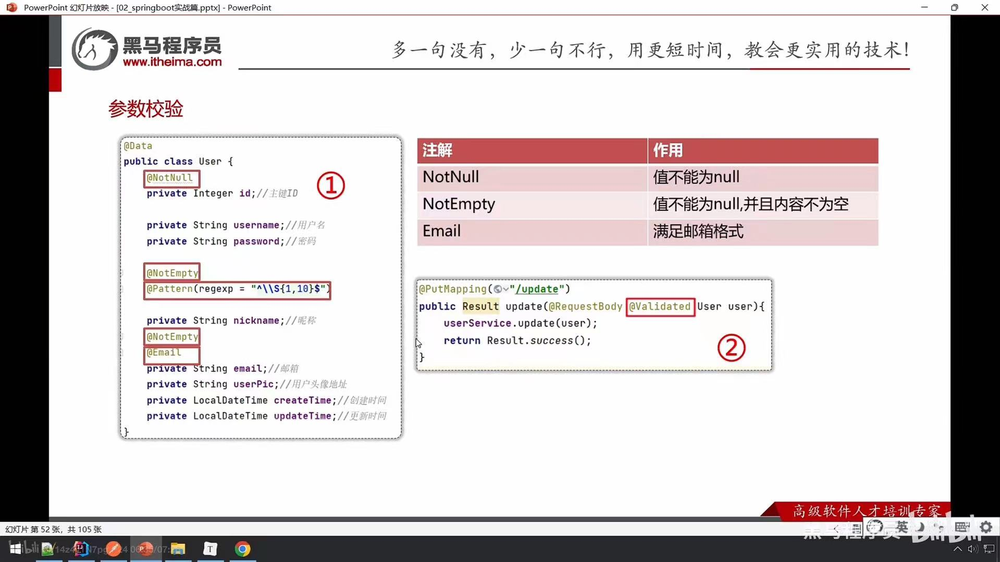

# big-event开发-用户（二）

## 获取用户详细信息

### 隐藏pwd-JsonIgnore

```java
// 在User类中
import com.fasterxml.jackson.annotation.JsonIgnore; // 注意不要导错

@JsonIgnore // 让springmvc把当前对象转换成json字符串的时候，忽略password
private String password;//密码
```

### 驼峰命名-下划线命名

```yml
mybatis:
  configuration:
    map-underscore-to-camel-case: true # 开启驼峰命名和下划线命名的自动转换
```

### ThreadLocal

#### 线程隔离

```java
public class TreadLocalTest {

    @Test
    public void testThreadLocalSetAndGet() {
        // 提供一个TreadLocal对象
        ThreadLocal tl = new ThreadLocal();

        // 开启两个线程
        new Thread(()->{
            tl.set("aa");
            System.out.println(Thread.currentThread().getName()+": "+tl.get());
        },"蓝色").start();
        new Thread(()->{
            tl.set("bb");
            System.out.println(Thread.currentThread().getName()+": "+tl.get());
        },"绿色").start();
    }
}
```



#### 调用remove方法释放

```java
@Override
public void afterCompletion(HttpServletRequest request, HttpServletResponse response, Object handler, Exception ex) throws Exception {
    // 清空ThreadLocal中的数据
    ThreadLocalUtil.remove();
}
```

## 更新用户基本信息

### 参数校验



## 更新用户头像

### 获取用户信息

```java
@Override
public void updateAvatar(String avatarUrl) {
    Map<String, Object> map = ThreadLocalUtil.get();
    Integer id = (Integer) map.get("id");
    userMapper.updateAvatar(avatarUrl, id);
}
```

### URL参数校验

```java
// @URL
@PatchMapping("/updateAvatar")
public Result updateAvatar(@RequestParam @URL String avatarUrl) {
    userService.updateAvatar(avatarUrl);
    return Result.success();
}
```

## 更新用户密码

### @RequestBody

springmvc自动读取请求体中json格式的数据转换为map集合对象

### 手动参数校验

```java
@PatchMapping("/updatePwd")
public Result updatePwd(@RequestBody Map<String,Object> params) {
    // 1.校验参数
    String oldPwd = (String) params.get("old_pwd");
    String newPwd = (String) params.get("new_pwd");
    String rePwd = (String) params.get("re_pwd");

    if(!StringUtils.hasLength(oldPwd) || !StringUtils.hasLength(newPwd) || !StringUtils.hasLength(rePwd)){
        return Result.error("缺少必要的参数");
    }
    // 原密码是否正确
    // 调用userService根据用户名拿到原密码，再和old_pwd比对
    Map<String,Object> map = ThreadLocalUtil.get();
    String username = (String) map.get("username");
    User loginUser = userService.findByUserName(username);
    if(!loginUser.getPassword().equals(Md5Util.getMD5String(oldPwd))){
        return Result.error("原密码填写不正确");
    }
    // newPwd和rePwd是否相同
    if(!rePwd.equals(newPwd)){
        return Result.error("两次填写的新密码不一样");
    }

    // 2.调用service完成密码更新
    userService.updatePwd(newPwd);
    return Result.success();
}
```
