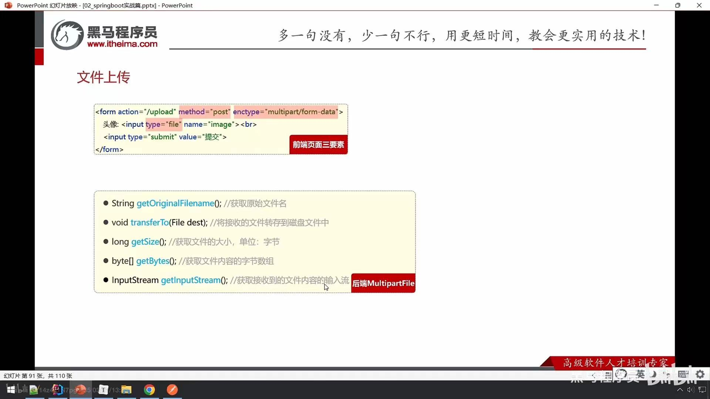
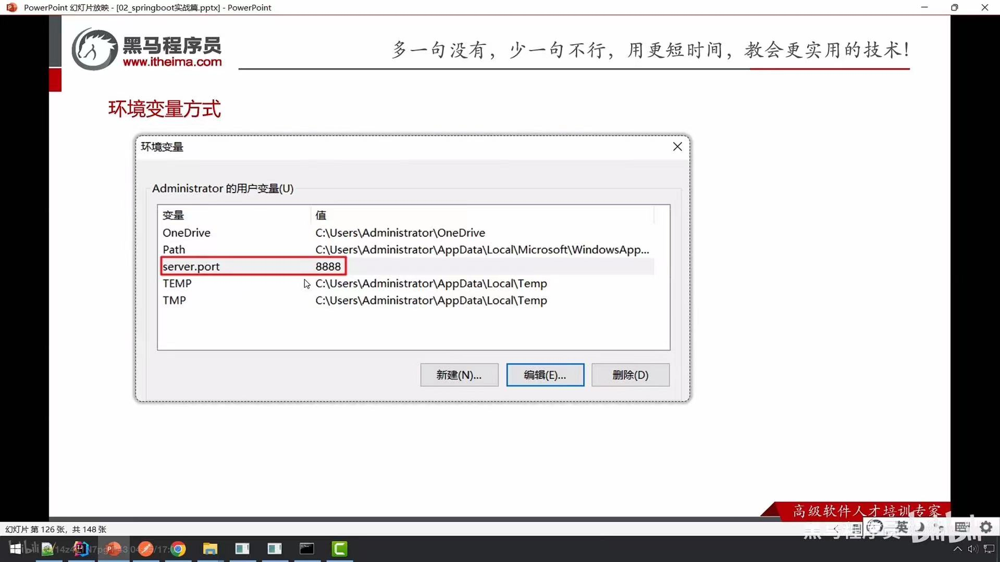
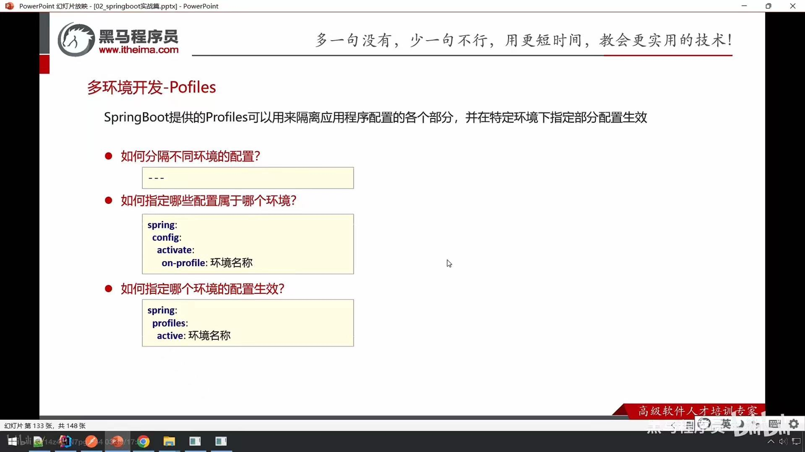
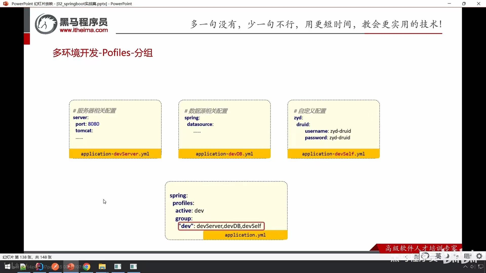

# big-event开发 

## 文章管理

### 新增文章

#### 自定义校验

1. 自定义注解State
2. 自定义校验数据的类StateValidation，实现ConstraintValidation接口
3. 在需要校验的地方使用自定义注解

```java
@Documented // 元注解（可抽取到帮助文档）
@Target({ElementType.FIELD}) // 元注解（标识该注解可用于什么位置 FIELD属性）
@Retention(RetentionPolicy.RUNTIME) // 元注解（标识该注解在哪个阶段保留 RUNTIME运行时）
@Constraint(validatedBy = {StateValidation.class}) // 指定提供校验规则的类
public @interface State {
    // 提供校验失败后的提示信息
    String message() default "state参数的值只能是已发布或者草稿";
    // 指定分组
    Class<?>[] groups() default {};
    // 负载 获取到该注解的附加信息
    Class<? extends Payload>[] payload() default {};
}
```

```java
public class StateValidation implements ConstraintValidator<State, String> {
    /**
     * @param value   将来要校验的数据
     * @param context
     * @return 返回false校验不通过 true校验通过
     */
    @Override
    public boolean isValid(String value, ConstraintValidatorContext context) {
        // 提供校验规则
        if (value == null) {
            return false;
        }
        if (value.equals("已发布") || value.equals("草稿")) {
            return true;
        }
        return false;
    }
}
```

### 文章分类列表查询

#### @RequestParam(required = false)

参数可为空

#### PageBean

```java
@Override
public PageBean<Article> list(Integer pageNum, Integer pageSize, Integer categoryId, String state) {
    // 1.创建PageBean对象
    PageBean<Article> pb = new PageBean<>();

    // 2.开启分页查询 PageHelper
    PageHelper.startPage(pageNum, pageSize);

    // 3.调用mapper
    Map<String, Object> map = ThreadLocalUtil.get();
    Integer userId = (Integer) map.get("id");
    List<Article> as = articleMapper.list(userId, categoryId, state);
    // Page中提供了方法，可以获取PageHelper分页查询后得到的总记录条数和当前页数据
    Page<Article> p = (Page<Article>) as;

    // 把数据填充到PageBean对象中
    pb.setTotal(p.getTotal());
    pb.setItems(p.getResult());
    return pb;

}
```

```xml
<!--pageHelper坐标-->
<dependency>
    <groupId>com.github.pagehelper</groupId>
    <artifactId>pagehelper-spring-boot-starter</artifactId>
    <version>1.4.6</version>
</dependency>
```

```xml
<?xml version="1.0" encoding="UTF-8" ?>
<!DOCTYPE mapper
        PUBLIC "-//mybatis.org//DTD Mapper 3.0//EN"
        "http://mybatis.org/dtd/mybatis-3-mapper.dtd">
<mapper namespace="com.itheima.bigevent.mapper.ArticleMapper">
    <!--动态sql-->
    <select id="list" resultType="com.itheima.bigevent.pojo.Article">
        select * from article
        <where>
            <if test="categoryId!=null">
                category_id=#{categoryId}
            </if>

            <if test="state!=null">
                and state=#{state}
            </if>

            and create_user=#{userId}
        </where>
    </select>
    
</mapper>
```

## 文件上传



### 本地存储

```java
@RestController
public class FileUploadController {
    @PostMapping("/upload")
    public Result<String> upload(MultipartFile file) throws IOException {
        // 把文件内容存储到本地磁盘
        String originalFilename = file.getOriginalFilename();
        // 保证文件的名字是唯一的，从而防止文件覆盖
        String filename = UUID.randomUUID().toString() + originalFilename.substring(originalFilename.lastIndexOf("."));
        file.transferTo(new File("D:\\Brain\\TempFile\\"+filename));
        return Result.success("url访问地址...");
    }
}
```

### 阿里云OSS

```java
public class AliOssUtil {
    // Endpoint以华东1（杭州）为例，其它Region请按实际情况填写。
    private static final String ENDPOINT = "https://oss-cn-beijing.aliyuncs.com";
    // 从环境变量中获取访问凭证。运行本代码示例之前，请确保已设置环境变量OSS_ACCESS_KEY_ID和OSS_ACCESS_KEY_SECRET。
    // EnvironmentVariableCredentialsProvider credentialsProvider = CredentialsProviderFactory.newEnvironmentVariableCredentialsProvider();
    private static final String ACCESS_KEY_ID = "LTAI5t9jXDzAXcSTAdNZsjtn";
    private static final String ACCESS_KEY_SECRET = "SXYChe3lsYwecUqofHdemdDuwbnmxC";
    // 填写Bucket名称，例如examplebucket。
    private static final String BUCKET_NAME = "big-event-astronaut";

    public static String uploadFile(String objectName, InputStream in) throws Exception {

        // 创建OSSClient实例。
        OSS ossClient = new OSSClientBuilder().build(ENDPOINT, ACCESS_KEY_ID, ACCESS_KEY_SECRET);

        String url = "";
        try {
            // 填写字符串。
            String content = "Hello OSS，你好世界";

            // 创建PutObjectRequest对象。
            PutObjectRequest putObjectRequest = new PutObjectRequest(BUCKET_NAME, objectName, in);

            // 如果需要上传时设置存储类型和访问权限，请参考以下示例代码。
            // ObjectMetadata metadata = new ObjectMetadata();
            // metadata.setHeader(OSSHeaders.OSS_STORAGE_CLASS, StorageClass.Standard.toString());
            // metadata.setObjectAcl(CannedAccessControlList.Private);
            // putObjectRequest.setMetadata(metadata);

            // 上传字符串。
            PutObjectResult result = ossClient.putObject(putObjectRequest);
            // url组成：https://bucket名称.区域节点/objectName
            url = "https://" + BUCKET_NAME + "." + ENDPOINT.substring(ENDPOINT.lastIndexOf("/") + 1) + "/" + objectName;
        } catch (OSSException oe) {
            System.out.println("Caught an OSSException, which means your request made it to OSS, "
                    + "but was rejected with an error response for some reason.");
            System.out.println("Error Message:" + oe.getErrorMessage());
            System.out.println("Error Code:" + oe.getErrorCode());
            System.out.println("Request ID:" + oe.getRequestId());
            System.out.println("Host ID:" + oe.getHostId());
        } catch (ClientException ce) {
            System.out.println("Caught an ClientException, which means the client encountered "
                    + "a serious internal problem while trying to communicate with OSS, "
                    + "such as not being able to access the network.");
            System.out.println("Error Message:" + ce.getMessage());
        } finally {
            if (ossClient != null) {
                ossClient.shutdown();
            }
        }

        return url;
    }
}
```

## 登录优化-redis

 (还没学，未优化，仅简单理解视频内容)

## SpringBoot其他

### 项目部署

1. 生成jar包
   - 执行package命令
2. 运行jar包
   - Java -jar jar包位置

3. 服务器要求
   - 有jre环境


### 属性配置

#### 命令行参数方式

--键=值 --server.port=10010

#### 环境变量方式



#### 外部配置文件方式

在jar包所在目录下添加配置文件application.yml

**优先级**

项目中 > 外部配置文件 > 环境变量 > 命令行参数

### 多环境开发-Profiles

#### 配置



- 若特定环境中的配置和通用信息冲突了，则特定环境中的配置生效
- 多文件配置：可将特定环境的配置写入不同的配置文档 application-环境名称.yml

#### 分组



