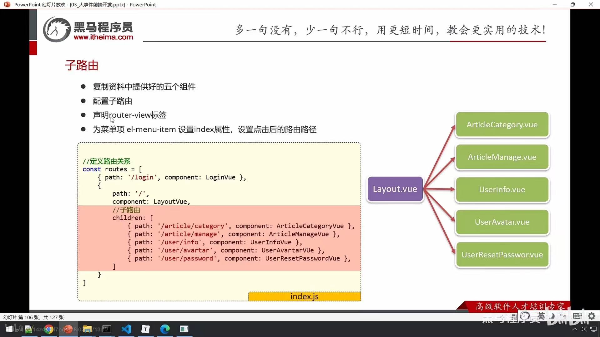
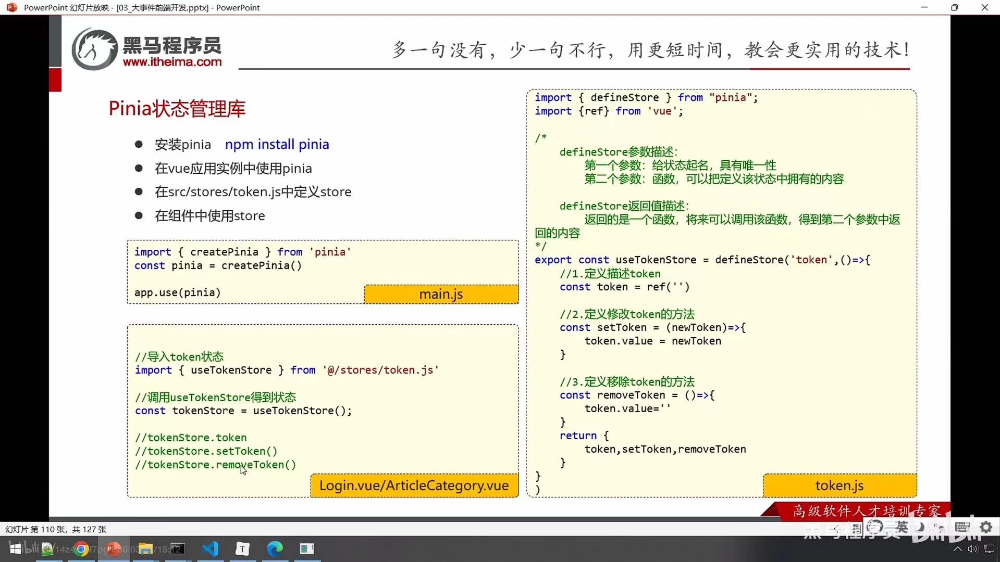
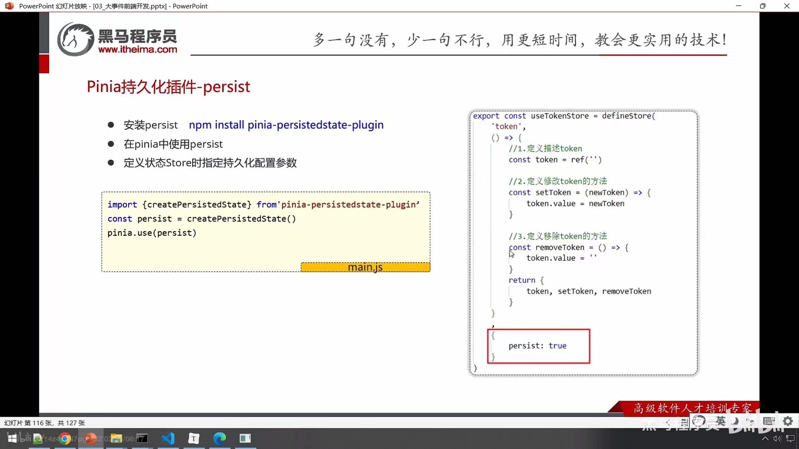

# big-event前端

## 开发步骤

- 搭建页面
- 绑定数据与事件
  - 表单校验

- 调用后台接口
  - 接口文档
  - src/api/xx.js封装
  - 页面函数调用

## 注册&登录

### 表单校验

- el-form标签上通过rules属性，绑定校验规则
- el-form-item标签通过prop属性指定校验项

### 跨域

由于**浏览器**的**同源策略**限制，向不同源（不同协议、不同域名、不同端口）发送ajax请求会失败

=> 配置代理：浏览器发送请求到5173，再从前端服务5173发送到后端服务8080

~~~js
server:{
    proxy:{
      '/api':{// 获取路径中包含了/api的请求
        target:'http://loacalhost:8080', // 后台服务所在的源
        changeOrigin:true, // 修改源
        rewrite:(path)=>path.replace(/^\/api/,'')// /api替换为''
      }
    }
  }
~~~

## 主页面

### 路由

- 根据不同的访问路径，展示不同组件的内容

**Vue Router**

- 安装
- 在src/router/index.js中创建路由器，并导出
- 在vue应用实例中使用vue-router
- 声明router-view标签，展示组件内容

~~~js
import {createRouter,createWebHistory} from 'vue-router';
// 导入组件
import LoginVue from "@/views/Login.vue";
import LayoutVue from "@/views/Layout.vue";

// 定义路由关系
const routes = [
    {path:'/login',component:LoginVue},
    {path:'/',component:LayoutVue},
]

// 创建路由器
const router = createRouter({
    history:createWebHistory(),
    routes:routes
})

// 导出路由
export default router;
~~~

~~~vue
// 切换组件
import { useRouter } from "vue-router";
const router = useRouter();
const login = async () => {
  // 调用接口
  let result = await userLoginService(registerData.value);
  ElMessage.success("登录成功");
  // 跳转首页 路由完成跳转
  router.push("/");
};
~~~

#### 子路由

**重定向**：redirect:'/article/manage'

### Pinia状态管理库

### Axios请求拦截器

~~~js
import { useTokenStore } from '@/stores/token.js';
// 添加请求拦截器
instance.interceptors.request.use(
    (config)=>{
        // 请求前的回调
        // 添加token
        const tokenStore = useTokenStore();
        // 判断有没有token
        if(tokenStore.token){
            config.headers.Authorization = tokenStore.token;
        }
        return config;
    },
    (err)=>{
        // 请求错误的回调
        Promise.reject(err)
    }
)
~~~

### Pinia持久化插件-persist

- Pinia默认是内存存储，当刷新浏览器的时候会丢失数据

### 未登录处理

~~~js
import router from '@/router'
//添加响应拦截器
instance.interceptors.response.use(
    result=>{
        // 判断业务状态码
        if(result.data.code===0){
            return result.data;
        }
        // 操作失败
        // alert(result.data.message?result.data.message:'服务异常')
        ElMessage.error(result.data.message?result.data.message:'服务异常')
        // 异步操作的状态转换为失败
        return Promise.reject(result.data)
    },
    err=>{
        // 判断响应状态码，如果为401，则证明未登录，提示请登录并跳转
        if(err.response.status===401){
            ElMessage.error('请先登录');
            router.push('/login');
        }else{
            ElMessage.error('服务异常')
        }
        return Promise.reject(err);//异步的状态转化成失败的状态
    }
)
~~~

