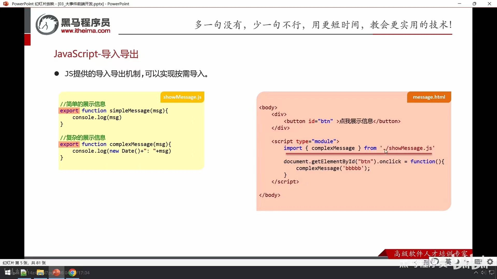
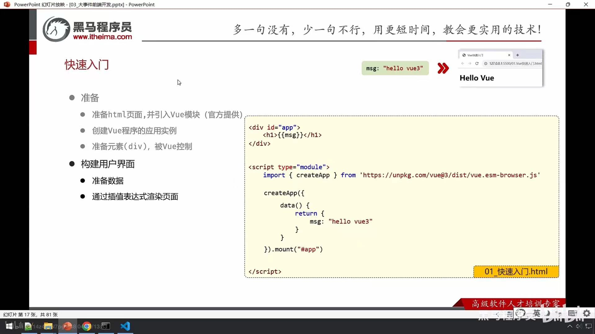
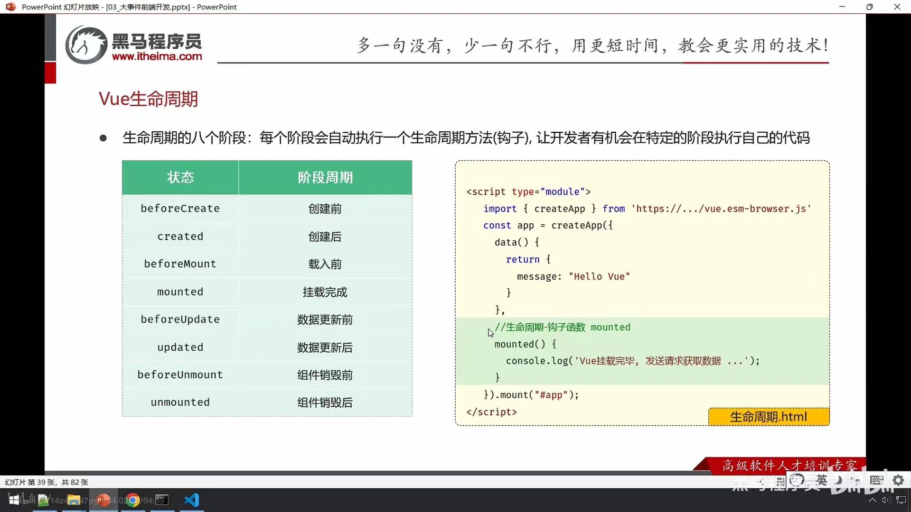
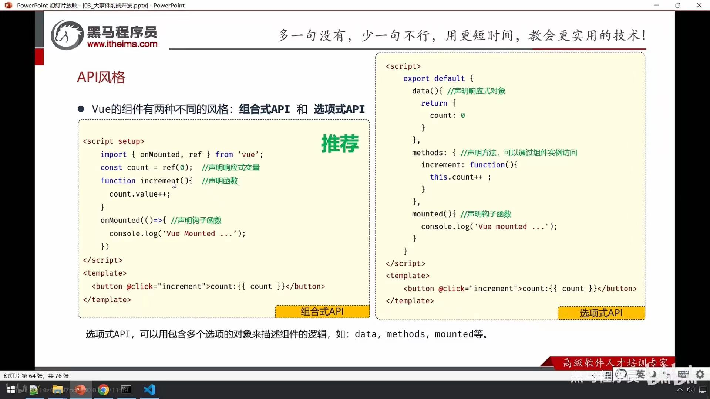

# Vue3

## 前置-js导入导出

- 批量导入：export {simpleMessage, complexMessage}

- 默认导出：

  - export default...
  - import messageMethods from ...  调用：messageMethods.simpleMessage()

## 快速入门

~~~ html
<body>
    

        <h1>{{msg}}</h1>
    

    <!-- 引入vue模块 -->
    
</body>
~~~

## 指令

### v-for

- 列表渲染，遍历容器的元素或者对象的属性
- v-for = "(item,index) in items"
  - items - 遍历的数组
  - index - 索引/下标（可省：item in items)

~~~html
<!-- 哪个元素要出现多次,v-for指令就添加到哪个元素上 -->
            <tr v-for="(article,index) in articleList">
                <td>{{article.title}}</td>
                <td>{{article.category}}</td>
                <td>{{article.time}}</td>
                <td>{{article.state}}</td>
                <td>
                    <button>编辑</button>
                    <button>删除</button>
                </td>
            </tr>
~~~

### v-bind

- 动态为HTML标签绑定属性值，如设置href,src,style样式等
- v-bind:属性名="属性值" （简化：**:属性名="属性值"**

~~~html
 <!-- <a v-bind:href="url">黑马官网</a> -->
        <a :href="url">黑马官网</a>
~~~

### v-if & v-show

- 用于控制元素的显示与隐藏

**v-if**

- v-if="表达式" ，表达式值为true则显示，false则隐藏
- 与 v-else-if / v-else 进行链式调用条件判断
- 原理：基于条件判断，来控制创建或移除元素节点
- 场景：不频繁切换

**v-show**

- v-show="表达式" ，表达式值为true则显示，false则隐藏
- 原理：基于css样式display来控制显示与隐藏
- 场景：频繁切换显示隐藏

~~~html
		手链价格为: =0 && customer.level<=1">9.9
        =2 && customer.level<=4">19.9
        29.9

         
        手链价格为: =0 && customer.level<=1">9.9
        =2 && customer.level<=4">19.9
        =5">29.9
~~~

### v-on

- 为html标签绑定事件
- v-on:事件名="函数名" （简化：**@事件名="函数名"**

~~~html
	

        <button v-on:click="money">点我有惊喜</button> &nbsp;
        <button @click="love">再点更惊喜</button>
    

    
~~~

### v-model

- 在表单元素上使用，双向数据绑定。可方便的**获取或设置**表单项数据
- v-model="变量名"

~~~html
		文章分类: <input type="text" v-model="searchConditions.category"/> {{searchConditions.category}}

        发布状态: <input type="text" v-model="searchConditions.state"/> {{searchConditions.state}}

		<button>搜索</button>
        <button v-on:click="clear">重置</button>

			methods:{
                clear:function(){
                    //清空category以及state的数据
                    //在methods对应的方法里面,使用this就代表的是vue实例,可以使用this获取到vue实例中准备的数据
                    this.searchConditions.category='';
                    this.searchConditions.state='';
                }
            }
~~~

## 生命周期

## ajax工具库-Axios

~~~html
<body>
    <!-- 引入axios的js文件 -->
    
    
</body>
~~~

## API风格

- setup：一个标识，告诉Vue需要进行一些处理，让我们可以更简洁的使用组合式api
- ref()：接受一个内部值，返回一个响应式的ref对象，此对象只有一个指向内部值的属性value
- onMounted()：在组合式api中的钩子方法，注册一个回调函数，在组件挂载完成后执行

## 案例优化

~~~js
	// 同步获取返回结果 async await
    const getAllArticle=async function(){
        let data =await articleGetAllService();
        articleList.value = data;
    }
~~~

~~~js
import axios from "axios";

// 公共前缀
const baseURL = 'http://localhost:8080';
const instance = axios.create({ baseURL })

// 添加响应拦截器
instance.interceptors.response.use(
    result => {
        return result.data;
    },
    err => {
        alert('服务异常');
        return Promise.reject(err); // 异步的状态转化成失败的状态
    }
)

export default instance;
~~~

